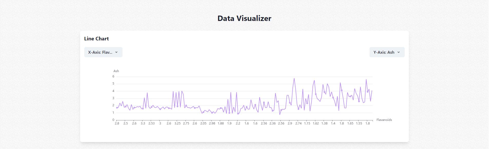
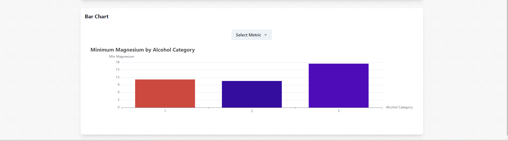

This project is a web-based application designed to visually represent a dataset concerning wine attributes using React and ECharts.   
It showcases the power of data visualization in extracting and presenting insights from complex datasets. 
Developed with **TypeScript** and leveraging the **ECharts** library wrapped in React components, this application presents an interactive and user-friendly interface for exploring wine data through line and bar charts.

**Features**
**Interactive Line Chart:** Visualizes the relationship between "Flavanoids" and "Ash" within the wine dataset, allowing users to explore how these two attributes correlate across different samples.

**Dynamic Bar Chart:** Displays the minimum "Magnesium" values for different "Alcohol" categories, providing insights into the compositional variance across wine types.

**Responsive Design:** Ensures a seamless user experience across various devices, including iPhone 5, iPhone X, iPad, iPad Pro, and general laptops.

**No Extra Dependencies:** Built using only essential libraries and tools, focusing on the core functionalities of React, TypeScript, and ECharts without relying on additional frameworks or utility libraries.

**Technology Stack**
**React:** Utilized for its efficient, declarative, and flexible approach to building user interfaces.
**TypeScript:** Provides type safety and enhances code quality and maintainability.
**ECharts for React:** Offers a comprehensive suite of charting and visualization tools for a wide array of data presentation needs.
**Chakra UI:** Supports the design system with a simple, modular and accessible component library for building a responsive UI.
**Yarn:** Used for managing project dependencies and ensuring consistent setups across environments.  

**Getting Started**
To run this project locally:

Clone the repository to your local machine.
Navigate to the project directory and install dependencies with **yarn install**.

Start the development server with yarn start. The application will automatically open in your default web browser.

**Project Structure**
$PROJECT_ROOT
├── public                  # Public files including index.html
├── src                     # Source files
│   ├── components          # Reusable components
│   │   ├── LineChart.tsx   # Line chart component
│   │   └── BarChart.tsx    # Bar chart component
│   ├── data                # Data for the project
│   │   └── WineData.json   # Dataset used for visualization
│   ├── App.css             # Global styles
│   ├── App.tsx             # Entry point of the application
│   └── index.tsx           # Root React component
├── package.json            # Project metadata and dependencies
├── tsconfig.json           # TypeScript configuration
└── yarn.lock               # Yarn lock file (do not edit manually)

**ScreenShots**

